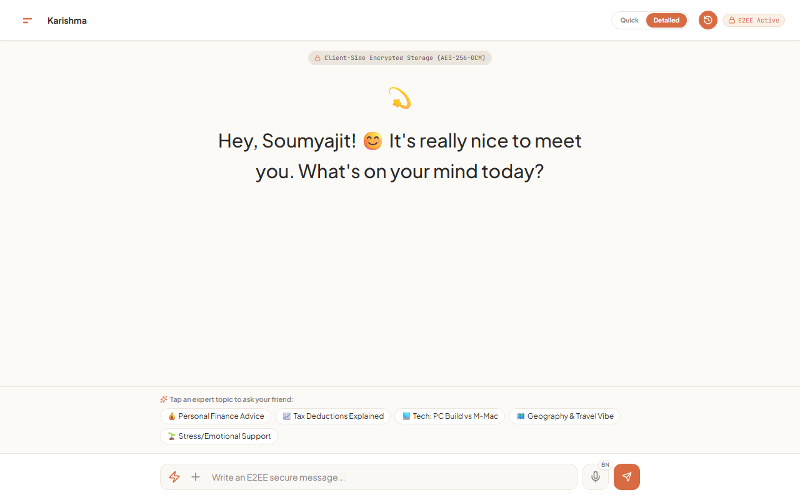
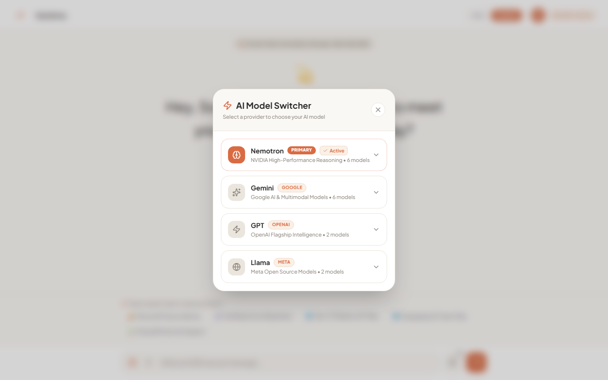
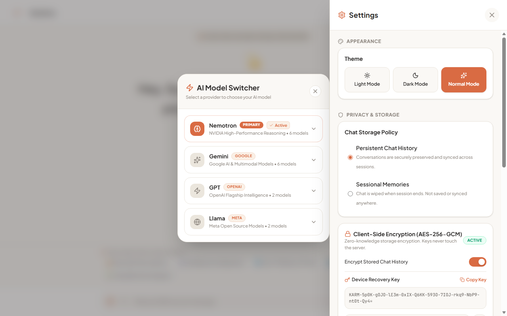
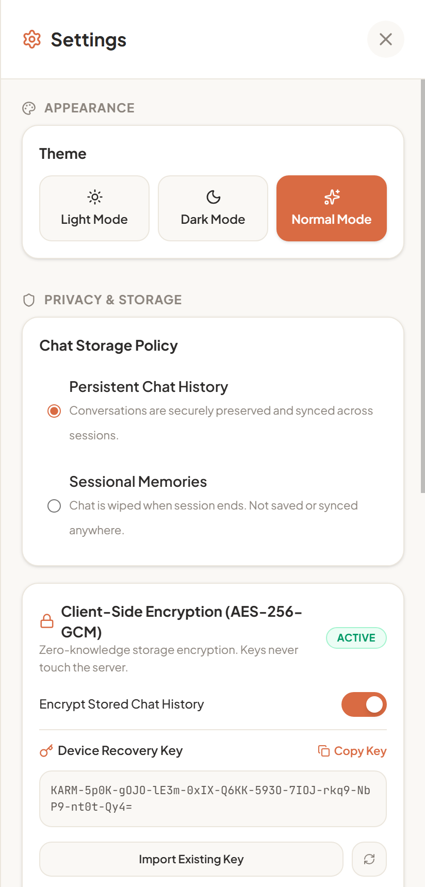
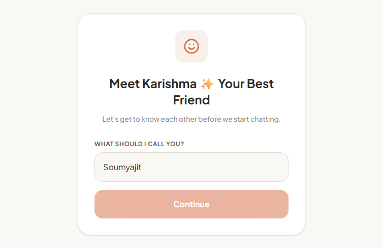
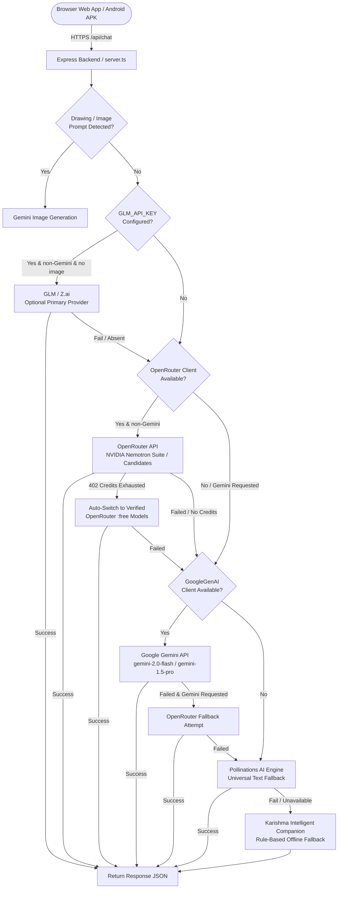

# Karishma AI

A full-stack, multimodal conversational companion application built with a React 19 frontend, an Express.js backend, client-side conversation history encryption, and a cross-platform architecture packaged for both modern web browsers and Android via Capacitor.

[](https://expressjs.com/)
[](https://react.dev/)
[](https://www.typescriptlang.org/)
[](https://tailwindcss.com/)
[](https://supabase.com/)
[](https://capacitorjs.com/)
[](https://expressjs.com/)

---

## ✨ Highlights

- **Multimodal AI Companion Persona:** Warm, natural, empathetic conversation style with native fluency in English, Bengali (বাংলা), and Banglish (Bengali in Latin script).
- **Multi-Provider AI Architecture:** Dynamic backend routing featuring NVIDIA Nemotron via OpenRouter as default, Google Gemini for chat, TTS, and multimodal vision, optional GLM/Z.ai support when configured, keyless Pollinations fallback, and a built-in offline rule engine.
- **Client-Side Storage Encryption:** Optional client-side symmetric stream encryption for saved conversation history before cloud synchronization, configured through in-app E2EE settings with custom key support.
- **Secure Offline Sync & Persistence:** Resilient local caching and automatic cloud history synchronization to Supabase with offline queue flushing upon network restoration.
- **Durable Email OTP Authentication:** Account registration and password resets backed by 6-digit cryptographic OTPs dispatched via Brevo and persisted in Supabase (`auth_otps`) with bcrypt hashing and strict attempt limits.
- **Voice Input & Studio TTS:** Real-time speech input with Banglish phonetics normalization and expressive audio response generation using Gemini TTS (`gemini-3.1-flash-tts-preview`, voice "Kore") with automatic browser Web Speech API fallback.
- **AI Image Generation & Ghibli Art Transformation:** Text-to-image synthesis and image-to-illustration transformation converting user photos into hand-drawn Japanese animation style art using Gemini vision and Pollinations.
- **Mobile-First Android Build:** Packaged with Capacitor 8 under package `com.karishma.ai`, configured with secure `https` scheme handling, native keyboard resizing, and runtime API base remapping.
- **Self-Healing & Diagnostic Safeguards:** Automatic request retries, provider failover cascades, in-memory error audit logging, and production token gating (`devOnlyGate`) protecting internal repair tooling.

---

## 🖼️ Screenshots

<table align="center" width="100%">
  <tr>
    <td width="50%" align="center">
      <br />
      <sub><b>Desktop Main Chat Interface & Topic Prompts</b></sub>
    </td>
    <td width="50%" align="center">
      <br />
      <sub><b>AI Model Switcher (Nemotron, Gemini, GPT, Llama)</b></sub>
    </td>
  </tr>
  <tr>
    <td width="50%" align="center">
      <br />
      <sub><b>Settings, Theme Selection & Storage Policies</b></sub>
    </td>
    <td width="50%" align="center">
      <br />
      <sub><b>Responsive Mobile View & Storage Policy Settings</b></sub>
    </td>
  </tr>
  <tr>
    <td colspan="2" align="center">
      <br />
      <sub><b>User Onboarding & Authentication Interface</b></sub>
    </td>
  </tr>
</table>

---

## 🚀 Live Demo

- **Live URL:** [https://karishma-ai-chatbot.onrender.com](https://karishma-ai-chatbot.onrender.com/)
- **Health Check Endpoint:** [https://karishma-ai-chatbot.onrender.com/api/health](https://karishma-ai-chatbot.onrender.com/api/health)

> [!NOTE]
> The live deployment is hosted on Render's free tier. If no inbound requests have arrived in the last 15 minutes, the container spins down to conserve resources. The first subsequent request will experience a cold start of approximately 45–60 seconds while the Docker container boots up. Once awake, performance returns to normal.

---

## 🧠 AI Architecture

Karishma utilizes a multi-tiered fallback architecture managed server-side inside `server.ts`. When an inference request is received, the backend inspects the selected model, validates caller credentials, detects image or drawing intents, and executes requests in a defined priority sequence.

### Backend Routing Pipeline



### Routing Order Breakdown

1. **Drawing Intent Detection:** Messages beginning with drawing requests (e.g., "draw a...", "generate an image of...") are intercepted by `detectImagePrompt()` and routed directly to image generation models.
2. **Optional Primary (GLM / Z.ai):** If `GLM_API_KEY` is present in the backend environment, GLM (`glm-4.6` via `https://api.z.ai/api/paas/v4`) is executed first for text turns without image attachments. *(Note: Disabled on the live deployment unless configured).*
3. **Primary Default (OpenRouter / NVIDIA Nemotron):** If the requested model is not an explicit Gemini model, the backend invokes OpenRouter with a candidate sequence prioritizing NVIDIA Nemotron models. If OpenRouter returns HTTP 402 (insufficient credits), it automatically switches immediately to live verified `:free` models (such as `nvidia/nemotron-3-super-120b-a12b:free`).
4. **Secondary / Gemini Path:** If a Gemini model is explicitly selected or if OpenRouter returns no response, the backend routes to Google Gemini (`@google/genai`).
5. **Tertiary OpenRouter Fallback:** If Gemini was explicitly requested but failed, OpenRouter is queried as a fallback.
6. **Universal Fallback (Pollinations AI):** If primary and secondary providers are unresponsive, requests route to Pollinations AI text endpoint (`https://gen.pollinations.ai/v1/chat/completions`).
7. **Companion Persona Engine:** If all remote network providers fail or are unconfigured, a deterministic rule-based companion fallback engine responds within the Karishma persona, ensuring zero dead-end application crashes.

---

## 🤖 Supported AI Models

The table below details every model supported by the codebase, clearly separating frontend UI options from actual backend execution targets.

| Provider | Model Identifier | Purpose / Capability | Routing Status |
| :--- | :--- | :--- | :--- |
| **NVIDIA (via OpenRouter)** | `nvidia/nemotron-3-ultra-550b-a55b` | Frontier reasoning & orchestration | **Default** in UI; candidate in backend |
| **NVIDIA (via OpenRouter)** | `nvidia/nemotron-3-super-120b-a12b` | High-throughput agentic reasoning | UI-listed; candidate in backend |
| **NVIDIA (via OpenRouter)** | `nvidia/nemotron-3-super-120b-a12b:free` | Free zero-credit tier reasoning | **Active Backend Fallback** (default 0-credit) |
| **NVIDIA (via OpenRouter)** | `nvidia/nemotron-3-ultra-550b-a55b:free` | Free zero-credit tier frontier reasoning | **Active Backend Fallback** |
| **NVIDIA (via OpenRouter)** | `nvidia/nemotron-3-nano-30b-a3b` | Fast MoE reasoning | UI-listed; candidate in backend |
| **NVIDIA (via OpenRouter)** | `nvidia/nemotron-3-nano-4b` | Ultra-compact edge inference | UI-listed; candidate in backend |
| **NVIDIA (via OpenRouter)** | `nvidia/nemotron-nano-9b-v2` | Compact versatile reasoning | UI-listed; candidate in backend |
| **NVIDIA (via OpenRouter)** | `nvidia/nemotron-3-nano-omni-30b-a3b-reasoning` | Multimodal omni-reasoning | UI-listed; candidate in backend |
| **Google Gemini** | `gemini-3.5-flash` / `gemini-3-flash-preview` | Fast multimodal reasoning | UI-listed (routes to Gemini client) |
| **Google Gemini** | `gemini-3.1-pro-preview` / `gemini-2.5-pro` | Precision deep reasoning | UI-listed (routes to Gemini client) |
| **Google Gemini** | `gemini-3.1-flash-lite` / `gemini-2.5-flash` | Low-latency chat | UI-listed (routes to Gemini client) |
| **Google Gemini** | `gemini-2.0-flash` / `gemini-1.5-flash` | Standard fast text generation | **Configured Backend Cascade** |
| **Google Gemini** | `gemini-3.1-flash-tts-preview` | Expressive neural speech synthesis (voice "Kore") | **Active Backend TTS Provider** |
| **Google Gemini** | `gemini-3.1-flash-image` | High-resolution image generation & vision transform | **Active Backend Image Provider** |
| **OpenAI (via OpenRouter)** | `openai/gpt-4o-mini` | Low-cost multimodal chat & vision | UI-listed; candidate in backend |
| **OpenAI (via OpenRouter)** | `openai/gpt-4o` | Frontier multimodal intelligence | UI-listed; candidate in backend |
| **Meta (via OpenRouter)** | `meta-llama/llama-3.3-70b-instruct` | Open-source flagship reasoning | UI-listed; candidate in backend |
| **Meta (via OpenRouter)** | `meta-llama/llama-3.1-8b-instruct` | Lightweight fast open-source model | UI-listed; candidate in backend |
| **Z.ai / Zhipu** | `glm-4.6` (`GLM_MODEL`) | Optional primary chat provider | **Optional** (only active when `GLM_API_KEY` set) |
| **Pollinations** | Flux / SDXL / Chat | Keyless fallback image & chat generation | **Fallback** (universal safety net) |
| **Local Engine** | Built-in Rule Engine | Karishma persona offline conversational fallback | **Offline Fallback** (zero network dependency) |

> [!IMPORTANT]
> A model appearing in the frontend UI selector represents user preference intent. If the target model provider account lacks credits or is temporarily unavailable, the backend automatically cascades through the fallback matrix to maintain continuous conversation availability.

---

## 🔐 Security & Privacy

### Security Controls & Infrastructure

- **Encrypted Transport:** All communication between web/mobile clients, the Express backend, and third-party APIs runs over TLS 1.3 / HTTPS.
- **Server-Side Secret Isolation:** Third-party credentials (`OPENROUTER_API_KEY`, `GEMINI_API_KEY`, `SUPABASE_SERVICE_ROLE_KEY`, `BREVO_API_KEY`) are stored exclusively in server environment variables. They are never transmitted to clients or compiled into the Android APK.
- **Secret Redaction & Sanitization:** All backend logs and outgoing HTTP error responses pass through `sanitizeSecrets()`, replacing real API keys, bearer tokens, and private database credentials with masked placeholders (`[REDACTED_SECRET]`).
- **Defensive Rate Limiting:**
  - `/api/chat`: 40 requests per minute per IP.
  - `/api/tts`: 30 requests per minute per IP (plus a 15-minute cooldown upon quota exhaustion).
  - `/api/generate-image` and `/api/transform-illustration`: 6 requests per minute per IP.
  - `/api/auth/send-otp` & `/api/auth/forgot-password`: 10 requests per 10 minutes per IP, with a 60-second cooldown per target email.
  - `/api/auth/verify-otp`: Maximum 5 verification attempts before the pending OTP is permanently revoked.
  - `/api/auth/login`: 20 attempts per 10 minutes per IP, and 10 attempts per 10 minutes per account email.
- **Password & OTP Security:** User account passwords and numeric OTP codes are hashed using `bcryptjs` (salt rounds: 10). Plaintext passwords and plaintext OTPs are never stored in the database.
- **Developer Endpoint Gate (`devOnlyGate`):** Development routes (`/api/self-repair/*` and `/api/test/*`) are blocked in production (`NODE_ENV=production`), returning HTTP 404 unless a constant-time verified `SELF_REPAIR_TOKEN` is supplied via `x-self-repair-token`.

---

### Client-Side Storage Encryption Model

Karishma includes an optional client-side payload encryption feature designed to obfuscate persisted conversation data before saving to cloud storage.

```text
[ Client Device: Browser / WebView ]
  │
  ├─ 1. Live Turn (Ephemeral Inference):
  │     PlainText Prompt ──────(TLS/HTTPS)─────> Express Server ──────(TLS)─────> AI Provider
  │                                                    │                              │
  │     Response <─────────────(TLS/HTTPS)───── Express Server <──────(TLS)───────────┘
  │     (Processed in server RAM only; never written to database tables during /api/chat)
  │
  └─ 2. Persistent Storage (Client-Side Encrypted Sync):
        PlainText Message + Local Key (`encryptionKey`)
           │
           ▼ [Client-Side Symmetric Stream Transformation]
        Cipher Payload: Base64 JSON Character Array
           │
           ▼ (HTTPS POST /api/history/save)
        Supabase Database (public.messages & public.conversations)
        (Stores cipher payload; server holds no encryption keys)
```

#### Mechanism Details

- **Key Configuration:** The key is configured on the client (defaulting to `"BEST_FRIEND_E2EE_KEY"` and stored in `localStorage` under `best_friend_encryption_key`).
- **Transformation:** When enabled (`encryptionEnabled: true`), messages are transformed via a symmetric XOR stream cipher (`m.text.charCodeAt(i) ^ encryptionKey.charCodeAt(i % encryptionKey.length)`) and serialized as Base64 JSON character arrays before cloud transmission.
- **Client Decryption:** Upon loading historical sessions from Supabase, the client reverses the transformation using the locally held key.
- **Visual Ciphertext Simulation:** The UI includes a client-side visual masking helper (`getCiphertext()`) and status badges (`E2EE Verified` / `E2EE Node`) when encryption mode is active.

> [!NOTE]
> **Technical Scope:** This client-side symmetric stream transformation is a lightweight payload masking mechanism designed for client-controlled persistence obfuscation. It does not replace industry-standard authenticated cryptographic standards (such as AES-GCM) or full end-to-end encryption across AI inference pipelines.

#### Honest Security Boundary: Storage vs. AI Inference

> [!IMPORTANT]
> - **Inference Requirement:** Hosted LLMs (NVIDIA Nemotron, Google Gemini, etc.) require readable prompt text to execute natural language reasoning.
> - **Ephemeral Processing:** During `/api/chat`, prompts travel over TLS to the backend and over TLS to the AI provider. The backend holds prompts in RAM only for the duration of the HTTP call and does not persist them.
> - **AI Provider Visibility:** The external AI provider processes prompt content during generation according to its own privacy policy.

---

## 🔑 Authentication

Karishma provides a multi-stage authentication system supporting both registered user accounts and guest mode:

1. **Guest Mode:** Immediate access without registration. A unique random guest identifier (`guest_<random>`) is stored locally, allowing conversations to function without server credentials.
2. **Account Creation & Email Verification:**
   - User submits full name, nickname, email, and password.
   - Server validates the domain against an allowed list (`gmail.com`, `outlook.com`, `yahoo.com`, `icloud.com`, `proton.me`, etc.) and rejects disposable email providers.
   - A 6-digit numeric OTP is generated (`crypto.randomInt(100000, 999999)`), hashed with bcrypt, and stored in Supabase `public.auth_otps`.
   - The OTP is emailed via Brevo transactional email.
3. **Verification & Activation:**
   - User inputs the 6-digit code.
   - The server verifies the code with bcrypt, increments attempt counters, checks expiration (10 minutes), and finalizes account creation in Supabase and Firestore.
4. **Session Management:**
   - Authenticated sessions issue UUID session tokens stored in the user account record.
   - User profiles support updating display names and nicknames (`/api/auth/update-profile`).
5. **Password Management:**
   - In-app password change for logged-in users via `/api/auth/change-password`.
   - Forgot password workflow (`/api/auth/forgot-password`, `/api/auth/verify-reset-otp`, `/api/auth/reset-password`) using email OTP verification before allowing password updates.

---

## 💾 Data & Conversation Sync

- **Primary Cloud Store (Supabase):**
  - Stored in PostgreSQL tables: `conversations`, `messages`, `users`, and `auth_otps`.
  - Accessed exclusively server-side through `SUPABASE_SERVICE_ROLE_KEY` with RLS protection.
- **Client Cache & Device Storage (`localStorage`):**
  - Active session state, client encryption key, response mode preferences, and offline queues.
- **Offline Sync Queue:**
  - If a network failure occurs during conversation saving or deletion, operations are queued in `localStorage` under `best_friend_sync_queue_<userId>`.
  - The client listens for `window.addEventListener('online')` to automatically flush pending operations when connectivity is restored.
- **Retention Settings:**
  - **Persistent Chat History:** Conversations are preserved locally and synchronized to Supabase.
  - **Sessional Memories:** Chat history is kept in memory only for the current session and discarded upon closing.

---

## 🎙️ Voice

- **Text-to-Speech (TTS):**
  - Primary TTS is powered by Google Gemini's audio model (`gemini-3.1-flash-tts-preview`) with prebuilt voice `"Kore"`.
  - Generates 24 kHz mono 16-bit linear PCM audio, converted server-side to standard WAV format and returned as a Base64 data URI.
  - Features language-specific pronunciation instructions for fluent English and natural Bengali.
  - If the server experiences Gemini TTS quota limitations (HTTP 429), a 15-minute cooldown activates, and the client falls back to browser voice synthesis.
- **Voice Input (STT):**
  - Utilizes the W3C Web Speech API (`webkitSpeechRecognition` / `SpeechRecognition`).
  - Integrated with a Banglish phonetics normalizer (`src/utils/banglishVoiceNormalizer.ts`) to convert Latin-scripted Bengali phonetics into clean conversational text.

---

## 🎨 Image Generation

- **Text-to-Image Generation (`/api/generate-image`):**
  - Powered by Gemini image models (`gemini-3.1-flash-image`, `gemini-3.1-flash-lite-image`) generating 1K square (1:1) illustrations.
  - Falls back to Pollinations AI (Flux / SDXL) if Gemini image quota is exhausted.
- **Image-to-Illustration Transformation (`/api/transform-illustration`):**
  - Transforms user photos or portraits into hand-drawn Japanese animation / Ghibli-inspired illustrations.
  - Sends the user's base64 image as an inline visual part alongside specialized conditioning prompts to preserve subject identity, lighting, and composition while altering artistic style.

---

## 🛠️ Self-Healing & Reliability

- **Client-Side Fault Recovery (`src/lib/selfHealing.ts`):**
  - Automatically retries transient network failures.
  - Automatically steps through candidate fallback models if a chosen provider is unavailable.
  - Maintains an in-memory error audit log accessible via `SelfHealingStatusModal.tsx`.
- **Server Self-Repair Engine (`server/selfRepairEngine.ts`):**
  - Capable of analyzing error stack traces using an LLM to generate code patches and verify them against local test suites.
- **Production Guard (`devOnlyGate`):**
  - **Security Restriction:** All endpoints under `/api/self-repair/*` and `/api/test/*` are guarded by `devOnlyGate`.
  - In production (`NODE_ENV=production`), these routes return HTTP 404 by default.
  - They can only be accessed if `SELF_REPAIR_TOKEN` is configured on the server and supplied in the `x-self-repair-token` header.

---

## 📱 Android App

Karishma packages its web application for Android using **Capacitor 8**, wrapping the client inside an Android WebView without duplicating UI code.

### Android Architecture

- **Application ID:** `com.karishma.ai` (configured in `capacitor.config.ts` and `android/app/build.gradle`).
- **SDK Targets:** `minSdkVersion = 24` (Android 7.0 Nougat), `compileSdkVersion = 36`, `targetSdkVersion = 36`.
- **Scheme Isolation:** Uses `androidScheme: 'https'` (`https://localhost`), ensuring LocalStorage and IndexedDB operate correctly inside the WebView.
- **Asset Separation:** Builds to a dedicated `dist-android/` directory (`npm run build:android`). This ensures server bundles (`dist/server.cjs`) and backend secrets are never included in the APK.
- **Dynamic API Base:** `src/lib/native.ts` rewrites relative `/api/...` calls to the URL specified in `.env.android` (`VITE_API_BASE`). Can also be overridden at runtime via `localStorage.setItem('karishma_api_base', 'https://your-url')`.

### Building the Android APK

#### Prerequisites
- Node.js 20+ and npm
- Java Development Kit (JDK) 17 or 21
- Android Studio with Android SDK Platform 36 and Build-Tools

#### Build Commands

1. **Configure Backend URL:**
   Open `.env.android` and set your live backend URL (no trailing slash):
   ```env
   VITE_API_BASE=https://karishma-ai-chatbot.onrender.com
   ```

2. **Install dependencies:**
   ```bash
   npm install
   ```

3. **Build the Android web bundle:**
   ```bash
   npm run build:android
   ```

4. **Sync Capacitor assets:**
   ```bash
   npx cap sync android
   ```

5. **Assemble Debug APK:**
   - **On Windows (PowerShell / CMD):**
     ```powershell
     cd android
     .\gradlew.bat assembleDebug
     ```
   - **On macOS / Linux:**
     ```bash
     cd android
     ./gradlew assembleDebug
     ```

6. **Locate the generated APK:**
   ```text
   android/app/build/outputs/apk/debug/app-debug.apk
   ```

---

## ☁️ Deployment on Render

Karishma is configured for one-click container deployment via `render.yaml` and `Dockerfile`.

### Build & Container Workflow

1. **Multi-Stage Dockerfile:** Uses `node:22-slim`. The build stage compiles the Vite client (`dist/`) and bundles the Express server with esbuild (`dist/server.cjs`). The production stage installs only production dependencies.
2. **Unified Service:** The Express server binds to `0.0.0.0:$PORT` (default `8080`), serving both `/api/*` endpoints and static frontend assets from `dist/` with SPA routing fallback to `index.html`.
3. **Health Check:** Render monitors `/api/health` before routing traffic.

### Deploy Steps

1. Push your repository to GitHub.
2. In the [Render Dashboard](https://dashboard.render.com/), select **New + → Blueprint** and link this repository.
3. Supply required environment variables when prompted.
4. Deployment completes in 5–8 minutes.

---

## 🗄️ Supabase Setup

Run `supabase/schema.sql` (or migrations in `supabase/migrations/`) in your Supabase SQL Editor:

1. **`conversations`**: Stores conversation IDs, user IDs, titles, and timestamps.
2. **`messages`**: Stores message payloads (`role`, `content`, and `is_encrypted` flags).
3. **`users`**: Stores user profiles, emails, bcrypt-hashed passwords, and session tokens.
4. **`auth_otps`**: Stores durable bcrypt-hashed OTP codes, expiration timestamps, resend cooldowns, and pending registration payloads.
5. **Row Level Security (RLS):** Enabled on all tables. Queries from the backend bypass RLS using `SUPABASE_SERVICE_ROLE_KEY`.

---

## 📧 Brevo / Email OTP Setup

1. Create an account at [Brevo](https://www.brevo.com/).
2. Generate an API Key under **SMTP & API → API Keys**.
3. Verify your sender email address (e.g. `karishma.ai@outlook.com`).
4. Set `BREVO_API_KEY` and `BREVO_SENDER_EMAIL` in your server environment.

---

## 🔧 Environment Variables

| Variable | Required | Purpose | Secret? |
| :--- | :--- | :--- | :--- |
| `PORT` | Optional | Server listening port (defaults to `8080`) | No |
| `NODE_ENV` | Optional | `production` or `development` | No |
| `OPENROUTER_API_KEY` | **Required** | Access to NVIDIA Nemotron, Llama, and GPT models | **Yes** |
| `GEMINI_API_KEY` | **Required** | Access to Google Gemini chat, TTS, and image models | **Yes** |
| `GLM_API_KEY` | Optional | Access to GLM / Z.ai chat provider (primary when set) | **Yes** |
| `GLM_BASE_URL` | Optional | GLM endpoint (defaults to `https://api.z.ai/api/paas/v4`) | No |
| `GLM_MODEL` | Optional | Model identifier for GLM (defaults to `glm-4.6`) | No |
| `POLLINATIONS_API_KEY`| Optional | High-tier access for Pollinations AI fallbacks | **Yes** |
| `BREVO_API_KEY` | **Required** | Dispatches real email OTP verification codes | **Yes** |
| `BREVO_SENDER_EMAIL` | Optional | Sender address for OTP emails (default `karishma.ai@outlook.com`) | No |
| `SUPABASE_URL` | **Required** | Project URL for Supabase Postgres database | No |
| `SUPABASE_SERVICE_ROLE_KEY` | **Required** | Service-role key for backend conversation & OTP storage | **Yes (Backend only)** |
| `APP_URL` | Optional | Public application URL sent to OpenRouter in headers | No |
| `SELF_REPAIR_TOKEN` | Optional | Token for developer-only diagnostic endpoints | **Yes** |
| `VITE_API_BASE` | Android only | Public backend URL compiled into Android APK (`.env.android`) | No |

---

## 💻 Local Development

### 1. Clone & Install

```bash
git clone https://github.com/7soumyajitghosh/Karishma-Ai-chatbot.git
cd Karishma-Ai-chatbot
npm install
```

### 2. Configure Environment

Copy `.env.example` to `.env`:

```bash
cp .env.example .env
```

Fill in `OPENROUTER_API_KEY`, `GEMINI_API_KEY`, `SUPABASE_URL`, `SUPABASE_SERVICE_ROLE_KEY`, and `BREVO_API_KEY`.

### 3. Run Development Server

```bash
npm run dev
```

The application will be accessible at `http://localhost:8080` (or the port defined by `PORT`).

### 4. Build for Production

```bash
npm run build
npm start
```

---

## 📦 Project Structure

```text
Karishma-Ai-chatbot/
├── android/                   # Native Android project generated by Capacitor
│   ├── app/                   # Android application module & build.gradle
│   └── gradlew.bat            # Gradle wrapper for Android builds
├── docs/
│   └── screenshots/           # Real application screenshots
├── public/                    # Static public assets and web manifest
├── scripts/
│   └── migrate_db_to_supabase.ts # Migration script for database records
├── server/
│   ├── otpStore.ts            # Durable OTP storage with Supabase fallback
│   ├── selfRepairEngine.ts    # Code repair and diagnostic engine
│   ├── supabaseHistory.ts     # Supabase chat history persistence
│   └── supabaseKey.ts         # Supabase credentials and key validation
├── src/
│   ├── components/            # React UI components (Modals, ErrorBoundary)
│   ├── lib/
│   │   ├── firebase.ts        # Firestore client and offline sync queue
│   │   ├── native.ts          # Capacitor Android bridge & API URL remapping
│   │   └── selfHealing.ts     # Frontend retry logic & error logger
│   ├── utils/
│   │   └── banglishVoiceNormalizer.ts # Banglish phonetics normalization
│   ├── App.tsx                # Main companion application UI & state
│   ├── index.css              # Tailwind CSS styling and theme definitions
│   └── main.tsx               # React application entrypoint
├── supabase/
│   ├── migrations/            # SQL migration scripts
│   └── schema.sql             # Complete PostgreSQL database schema
├── capacitor.config.ts        # Capacitor configuration (com.karishma.ai)
├── Dockerfile                 # Multi-stage production container build
├── package.json               # Dependencies and build scripts
├── render.yaml                # Render Infrastructure-as-Code Blueprint
├── server.ts                  # Express backend & AI provider routing engine
└── tsconfig.json              # TypeScript compiler configuration
```

---

## 🔄 API Overview

The following table summarizes the primary endpoints exposed by `server.ts`:

| Method | Endpoint | Purpose | Access Control |
| :--- | :--- | :--- | :--- |
| `GET` | `/api/health` | Health status and integration config check | Public |
| `POST` | `/api/chat` | Main AI chat completion (Nemotron/Gemini/GLM/Pollinations) | Client-Origin / BYOK / Rate-limited |
| `POST` | `/api/tts` | Gemini Neural Speech Synthesis (voice "Kore") | Client-Origin / BYOK / Rate-limited |
| `POST` | `/api/generate-image` | Gemini text-to-image generation | Client-Origin / BYOK / Rate-limited |
| `POST` | `/api/transform-illustration` | Image-to-Ghibli-style illustration transformation | Client-Origin / BYOK / Rate-limited |
| `POST` | `/api/auth/send-otp` | Generate & email 6-digit verification code | Rate-limited (10 per 10m) |
| `POST` | `/api/auth/verify-otp` | Verify OTP code and activate user account | Rate-limited (5 attempts) |
| `POST` | `/api/auth/login` | Authenticate user via email and password | Rate-limited (bcrypt) |
| `POST` | `/api/auth/me` | Fetch active user session profile | Bearer Token / Session |
| `POST` | `/api/auth/update-profile`| Update user full name and nickname | Authenticated |
| `POST` | `/api/auth/change-password`| Update account password | Authenticated |
| `POST` | `/api/auth/forgot-password`| Request password reset code via email | Rate-limited |
| `POST` | `/api/auth/reset-password` | Complete password reset with verified OTP | Rate-limited |
| `POST` | `/api/history` | Fetch persisted chat sessions for user | User ID scoped |
| `POST` | `/api/history/save` | Persist conversation payload | User ID scoped |
| `POST` | `/api/history/delete` | Delete conversation session | User ID scoped |
| `POST` | `/api/self-repair/*` | Diagnostic self-repair & rollback engine | `devOnlyGate` (Token required) |

---

## 🧪 Verification & Testing

### 1. TypeScript Compilation Check
Verify type integrity across all server and frontend code:

```bash
npm run lint
```

### 2. Backend Health Verification
Query the local or deployed health endpoint:

```bash
curl http://localhost:8080/api/health
```

Expected response format:
```json
{
  "status": "ok",
  "env": "production",
  "otpStore": "supabase",
  "configured": {
    "supabase": true,
    "brevo": true,
    "glm": false,
    "openrouter": true,
    "gemini": true
  },
  "devEndpoints": "disabled"
}
```

---

## ⚠️ Important Security Notes

- **Never Commit Secrets:** Never commit `.env` files, Supabase service-role keys, or provider API keys to public repositories.
- **Android APK Distribution:** APK packages are distributable zip archives. Never embed private API keys in `.env.android` or client source files.
- **Storage Encryption Scope:** When client-side encryption is enabled, historical messages are encoded on the device before cloud storage. The server does not store or process the client encryption key.
- **Inference Scope:** Prompts sent during live chat are processed in RAM by the backend and transmitted to the selected AI provider to generate responses. Do not confuse client-side storage encryption with complete zero-knowledge AI inference.

---

## 🗺️ Roadmap

- [ ] Support for local on-device LLM inference via WebGPU / ONNX Runtime to enable full end-to-end zero-knowledge inference.
- [ ] Export and import encrypted chat archives directly into standalone files.
- [ ] Biometric lock integration (Fingerprint / Face Unlock) for the Android APK using Capacitor Biometric plugins.
- [ ] Additional voice options and customizable conversational tone presets.

---

## 🤝 Contributing

Contributions, issue reports, and feature requests are welcome!

1. Fork the repository.
2. Create a feature branch (`git checkout -b feature/amazing-feature`).
3. Commit your changes (`git commit -m "feat: add amazing feature"`).
4. Push to your branch (`git push origin feature/amazing-feature`).
5. Open a Pull Request.

---

## 📄 License

This repository does not currently include an open-source license file. All rights are reserved by the repository owner unless otherwise specified.

---

## 👨‍💻 Author

Developed with care by **Soumyajit Ghosh** ([@7soumyajitghosh](https://github.com/7soumyajitghosh)).

---

## ⭐ Support

If you find Karishma AI interesting or useful, please consider giving the repository a ⭐ on GitHub!
